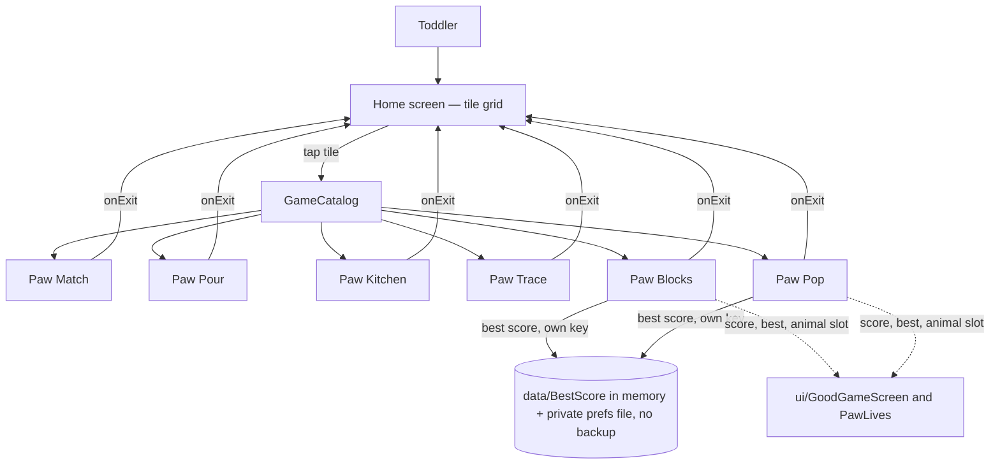

# Architecture

*Owned by the architect agent. If code and this doc disagree, fix one of them.*

## Stack
- **Language/UI**: Kotlin + Jetpack Compose (native Android). See ADR 2026-09-22 for why over Godot.
- **Local storage**: one private `SharedPreferences` file (`paw_play_bests`, a platform API, no dependency) holding exactly one integer per scored game: Paw Blocks' and Paw Pop's best score (0 to 999,999). Nothing else is saved; the other four games store nothing. The file is excluded from cloud backup and device transfer, and the app has no `INTERNET` permission. See ADRs "Best scores" and "The saved number never leaves the phone" (2026-09-25). DataStore was considered and not used.
- **Third-party dependencies**: none beyond standard AndroidX/Compose libraries. No ad SDK, no analytics SDK, no billing library, no network library.

## Shape: a hub with pluggable game modules
The app is one shell (the home screen) plus a growing set of independent games. Each game is a **module that knows nothing about the others or about the shell beyond one small contract**:

```kotlin
interface MiniGame {
    val id: String              // stable, e.g. "paw-match" — never reused once shipped
    val icon: @Composable () -> Unit   // the home-screen tile's icon, no text
    val content: @Composable (onExit: () -> Unit) -> Unit  // the game itself; calls onExit() to return home
}
```

- Each game lives in its own package (`games/pawmatch/`, `games/<nextgame>/`), owns its own state, and is added to a single static list (`GameCatalog.kt`) that the home screen renders as a grid of tiles — one tile per registered game, in list order.
- **Adding a game is additive only**: a new package + one line in `GameCatalog.kt`. No existing game, and nothing in the home screen shell, should need to change to add the next one. If a change request would require touching another game to add a new one, that's an architecture problem — stop and flag it rather than special-case it.
- The home screen never shows a tile for a game that isn't actually built and registered — no "coming soon" placeholders in the shipped app (see PRD, out of scope). The grid simply has as many tiles as there are entries in the catalog.
- The home screen's tile grid and Paw Match's card grid both use a shared `AdaptiveSquareGrid` composable (`app/src/main/java/com/pawplay/app/ui/AdaptiveSquareGrid.kt`): given N same-size square things, it picks whichever column count (2-4) makes them as big as possible while still fitting on screen with no scrolling, never below a 48dp touch-target floor. Any future screen with the same "N things, must fit, no scroll" shape — including the home shelf as it grows toward its ~dozen-game target — reuses this rather than re-deriving the layout math. See `docs/DECISIONS.md`, 2026-09-23/24.
- A `MiniGame`'s `icon` composable receives the tile size it's being drawn at (not a fixed dp value), since the same tile might render at 220dp with one game on the shelf or under 100dp with a dozen. Every icon in `AnimalIcons.kt` is written as a fraction of its container size for exactly this reason — a new game's tile icon should follow the same pattern.
- Every `MiniGame.content` gets an `onExit` callback (a large, obvious "home" icon inside the game) rather than the system back button being the only way out — consistent, discoverable, works the same in every game.

## System diagram

No server, no API, no database, no network calls. Fully offline. A game that isn't built is not in the diagram or the code: a future game is just a future catalog entry. The only stored thing is the small best-score file above; Blocks and Pop reach it and the shared good-game screen through `data/` and `ui/`, never through each other.

**Shared code for the two scored games** (ADR "Shared pieces for the two scored games", 2026-09-25):
- `data/BestScore.kt` (pure Kotlin, unit-tested with a fake store): `IntStore` (`read(key): Int?`, `write(key, value)`), `BestScore(key, store)` with `best`, `load()` (off the main thread, merges with `max`), `submit(score): Boolean` (clamps to 999,999, writes only when it beats the best, swallows every failure, so the in-memory best is the fallback), `MAX = 999_999`.
- `data/BestScores.kt` (Android glue): a process-wide map of `BestScore` by key so the in-memory best survives leaving a game, `SharedPrefsIntStore` (reads through `getInt`, writes with `apply()`, never `commit()`), `warmUp(context)` (called once from `MainActivity.onCreate`; only starts the platform's background load), and `rememberBestScore(key)`. Each game owns its key string (`best.paw-blocks`, `best.paw-pop`).
- `ui/GoodGameScreen.kt`: `GoodGameScreen(score, best, isNewBest, animal: @Composable (Modifier) -> Unit, onPlayAgain, onHome, modifier)`. 0.5s fade-in, rosette, two 72dp+ buttons, new-best glow and hop, and the 0.6s touch guard plus exactly-once latch (`ui/GoodGameGate.kt`, pure, unit-tested). The game passes its own smiling animal in the `animal` slot, so `ui/` imports no game drawing.
- `ui/PawLives.kt`: `PawLivesRow(paws, fadingIndex, fadeStartMs, nowMs)` and `ScoreNumber(value)` (count-up under 0.4s, no flash or bounce).
- `ui/` and `data/` may import only the two public Paw Match icons (`HomeGlyphIcon`, `PawPrintIcon`) from any game, until the shared-drawings follow-up moves them; the independence tests enforce it.
- `MainActivity` in the manifest handles configuration changes itself (`configChanges`), so a dark-mode or font-size change does not restart the app and lose the game in progress.

Paw Pour's package (`games/pawpour/`): `PawPourLogic.kt` (rules, ramp, generation, round state), `PawPourSolver.kt` (solvability search), `PawPourLayout.kt` (tube sizes/positions as plain numbers), and the Compose files `PawPourGame.kt`, `TubeView.kt`, `BandStyle.kt`. Like Paw Match, only the logic/solver/layout files are unit-tested; the Compose files just call into them.

Paw Trace's package (`games/pawtrace/`) splits the same way. Pure Kotlin, unit-tested on a plain JVM: `TraceGeometry.kt` (SVG-subset parser and the 1.5-unit sampler), `TraceGlyphs.kt` (the 46 glyphs as data), `PawTraceLogic.kt` (paint model, marker, finger rules, `TraceSession`), `PawTraceRamp.kt` (the shapes, numbers, letters ramp) and `PawTraceLayout.kt` (where things go, as plain numbers). Compose: `PawTraceGame.kt` (game object, screen, frog, celebration, buttons, tile icon), `TraceDrawing.kt` (guide, paint, glow, paw prints, and a per-glyph path cache), `TraceFrog.kt` (the frog's face, drawn inside the package) and `TraceColors.kt`. Paw Trace imports nothing from Paw Kitchen or Paw Pour, and from Paw Match only the public `HomeGlyphIcon` and `PawPrintIcon`, the same pattern Paw Pour and Paw Kitchen use; a unit test (`TraceQaTest`) fails if another cross-game import appears.

Paw Blocks' package (`games/pawblocks/`) splits the same way. Pure Kotlin, unit-tested on a plain JVM: `BlockShapes.kt` (the 8 families with their colours and marks, and the 16 shapes), `PawBlocksBoard.kt` (the immutable board: legality, row and column completion, growth), `PawBlocksRamp.kt` (the ramp table and every duration), `PawBlocksTray.kt` (the tray dealer with the fit guarantee, and the gentle clear-out), `PawBlocksSession.kt` (the timed session) and `PawBlocksLayout.kt` (screen numbers, snap maths and `DragTracker`, the first-finger rule). Compose: `PawBlocksGame.kt` (game object, screen, touch layer, home button, tile icon), `BlocksUi.kt` (the drag and the playing effects), `BlocksScene.kt` (drawing the play area), `BlocksDrawing.kt` (cells, marks, ghost), `BlocksCritters.kt` (the six animals, drawn inside the package) and `BlocksColors.kt`. Added 2026-09-25: `PawBlocksScoring.kt` (pure: points table and score cap), and `PawBlocksSession.kt` grows score, paws, phase and the game-over rule; `BlocksLayout` gets the top-strip numbers for the score and paws. Paw Blocks imports nothing from Paw Kitchen, Paw Pour or Paw Trace, and from Paw Match only the public `HomeGlyphIcon` and `PawPrintIcon`; `PawBlocksIndependenceTest` fails on any other cross-game import, and also fails if another game imports Paw Blocks. Layout: the panel follows the width (6dp from the sides, at most 348dp, so a 9x9 cell is 37.8dp at 360 wide and 33.3dp at 320 wide), and the tray sits 24dp in from the screen sides to stay off the back-gesture strip. Per-frame code allocates little: block sets and their widest and tallest sides are built once per stage, slots are read with `slot(i)`, the animal's paths are parsed once, and one path is reused for the shimmer bands.

Paw Pop's package (`games/pawpop/`) splits the same way. Pure Kotlin, unit-tested on a plain JVM: `PawPopRamp.kt` (every number of the rules in `PopMetrics`, and the five-stage ramp table), `PopShapes.kt` (the five silhouettes' hit ellipses, the five gifts, the six target colours with their luminance maths, and the path data the tests also read) and `PawPopLogic.kt` (`PopSession`: the ship, stars, targets, gift, effects, and the spawn and carrier scheduler, all advanced by `step(dt)`; plus the gift's glide curve and the glow's breathing curve). Compose: `PawPopGame.kt` (game object, screen, touch layer, home button, tile icon), `PopUi.kt` (frame clock and pointer changes in, one state holder that redraws every frame), `PopScene.kt` (the still sky, and the moving scene), `PopDrawing.kt` (targets, the four animals, the gifts, star, sparkle and ship, all as vectors in local units with paths and strokes made once) and `PopColors.kt`. Added 2026-09-25: `PopPath.kt` (pure: straight legs, sharp alternating turns, edge and 0.9s rules, speed cap and re-pick), `PopMetrics`/`PopStage` get the new ramp columns, paws, grace and `SKY_TOP`, and `PopSession` gains `score`, `paws`, `graceLeft`, `phase`, `bestBefore` and one `isPoppable` check used by stars, big stars, ribbon and wave. Paw Pop imports nothing from Paw Blocks, Paw Kitchen, Paw Pour or Paw Trace, and from Paw Match only the public `HomeGlyphIcon` and `PawPrintIcon`; `PopIndependenceTest` fails if another cross-game import appears. The animal faces, home button and sparkle are its own copies (worth moving to shared `ui/` in one follow-up touching all six games).

## Data model
- **MiniGame catalog entry**: id, icon composable, content composable (see contract above). Static list, no persistence.
- **Paw Match round state** (in-memory only): list of Cards (id, matched pair id, icon reference, revealed, matched), count of matched pairs, derived "is round complete" flag.
- **Paw Pour round state** (in-memory only): a `Board` (tubes as bottom-first lists of `BandColor`, plus capacity) wrapped in a `RoundState` (round number, the board, `history` of every pour as `Step(boardBefore, move)`, and `safeDepth` = how many pours lead to the latest position known to be finishable). The ramp (`specForRound`) is a pure function of the round number, capped at round 6 (9 tubes, 7 colours). Selection, the pour animation and wobble live in the composable, not in the round state.
- **Paw Kitchen state** (in-memory only, `games/pawkitchen/`): a `KitchenState` holds the menu (list of `Dish`), customers served this session, the current customer (a Paw Match `Critter`), the `Order` (dish + ingredient ids in shelf order), the tray (ingredient ids in a fixed random position order), the set of ingredients on the dish, and a phase (`BUILDING` or `SERVING`). A `Dish` is pure data: id, base ingredient, shelf of 3-6 ingredient ids. All rules are pure functions in `PawKitchenLogic.kt` (ramp, order generation, add/remove/toggle, exact-match, serve, next customer), unit tested with no Android.
- **Paw Kitchen content** (`KitchenMenu.kt`, `KitchenIcons.kt`): a `DishSpec` pairs a `Dish` with one vector picture per shelf ingredient and a `DishView` that says which pieces are drawn (and where they can be tapped) for the ingredients currently on the dish. **Adding a dish = adding one `DishSpec` to `KitchenMenu.specs`**; ordering, tray, serve, ramp and the screen do not change. `KitchenMenuTest` checks every dish in the menu is complete.
- **Paw Trace state** (in-memory only, `games/pawtrace/`): a `Glyph` is an id, a stage (1-4) and its strokes as SVG path strings on a 100 x 100 box; strokes are parsed (absolute M, L, C only) and sampled every 1.5 units. `TracePaint` is one glyph's painting: per stroke, which samples a finger painted (`touched`), which are covered (touched plus the gap that fills itself at 85%), and whether it is done; plus which stroke is being painted (`current`). `RampState` is the child's place on the ramp (stage, glyphs completed once, new glyphs since the last mixed-in one, the glyph on screen). `TraceSession` ties them together with the phase (`TRACING` or `CELEBRATING`) and `PrimaryPointer` (which finger paints). Everything is in glyph units; only the sizes made for a fingertip (32dp corridor, 56dp band, 48dp frog lead, 134dp hint walk) are dp constants in `TraceMetrics`, converted to glyph units by `TraceTuning` for whatever box size the screen gets.
- **Paw Blocks state** (in-memory only, `games/pawblocks/`): a `Board` is an N x N grid where each cell is empty or holds the `Family` of the block that filled it (the colour and mark come from the family, so that is all the drawing needs). `BlocksSession` holds the board, `clears` (lines the child made himself; this alone drives the ramp), the tray as three slots (a `BlockShape` or empty), the stage the tray was dealt at, and a few deadlines in milliseconds. Time is always passed in (the screen's frame clock, or a virtual clock in tests), so `place(slot, row, col, now)` and `tick(now)` are deterministic. `BlocksUi` (Compose side) holds only what is on screen: the `DragTracker` and the playing effects, each a start time. **Score, paws and ending (2026-09-25):** `BlocksSession` also holds `score` (from `PawBlocksScoring.kt`: 3 per block plus 10 / 30 / 60 / 100 for 1 / 2 / 3 / 4+ lines, clamped to 999,999), `paws` (3, only goes down), `phase` (`PLAYING` or `GAME_OVER`), `gameOverAt`, and `bestBefore` (the saved best when this game began) with `isNewBest = score > bestBefore`; the screen only draws them, feeds the score to `BestScore.submit`, and shows `GoodGameScreen` when `phase == GAME_OVER`. Nothing in the session is saved; only the best score is, by the screen, through `data/`.
- **Paw Pop state** (in-memory only, `games/pawpop/`): a `PopSession` holds the ship (`shipX`, where the newest finger wants it, and which fingers are down and which one steers), the targets on screen (kind, colour, size, position, its straight-line path state in `PopPath.kt` (downward `speed`, `side`, `legLeft`, `sinceTurn`, latched `entered` and `missed`), and the gift inside if it is a carrier), a fixed pool of 15 stars, a fixed pool of 16 pop and arrival pictures, at most one gift in flight, the running effects (a star effect with its time left, slow drift with its time left, the wave), and the hidden pop count that drives the ramp. Time is only ever passed to `step(dtSeconds)`, capped at 50ms a step, and all randomness comes from an injected `Random`, so a seeded session replays exactly. **Score, paws and ending (2026-09-25):** it also holds `score` (1 per pop, 3 per carrier, any route, clamped to 999,999), `paws` (3, only goes down), `graceLeft` (3s after a paw is lost, during which misses are free), `phase` (`PLAYING`, then `ENDING` for 0.5s while everything fades, then `OVER`), and `bestBefore` with `isNewBest = score > bestBefore`. The hidden pop count still drives only the ramp, and is not the score (a carrier is one pop for the ramp and 3 points). Nothing in the session is saved; only the best score is, by the screen, through `data/`.
- **Saved best scores** (the only persisted data in the app): two integers, `best.paw-blocks` and `best.paw-pop`, in the private preferences file `paw_play_bests`. Each is 0 to 999,999; an absent, non-integer, negative or too-large stored value reads as 0; a failed write is ignored and the in-memory `BestScore.best` carries on for the app session. No name, date, history, board, paws or stage is stored. Excluded from backup and device transfer. There are no other preferences: no settings, no theme.

## Key flows
- **App open → home**: app launches straight into the home screen tile grid. No splash screen with text.
- **Tile tap → game**: tap a tile → that game's `content` composable takes over the full screen.
- **Paw Match round**: shuffle N pairs of animal icons into a grid → all cards face-down → tap flow (flip, compare after a short delay, match-and-lock or mismatch-and-flip-back) → win screen (play again / home).
- **Paw Pour round**: `generateBoard` deals a shuffled board and only keeps it if it is well mixed and the solver proves it winnable → tap a tube to lift it, tap another to pour (`Board.tap` decides: select / put down / pour / gentle wobble) → the pour animates, then `RoundState.poured` records it → `checkedFinishable()` runs the solver off the main thread → if the round can no longer be finished (no pour left, or pours that can't win), wait ~1s, then `undoLast()` step by step with a reverse animation back to `safeDepth`, and play continues → when every colour is gathered into one full tube (`Board.isSolved`; the same test as the finished-tube border and sparkle, so they always agree), win overlay (play again = next round on the ramp / home). Boards are dealt off the main thread, and "play again" keeps the win overlay up until the next board is ready. `RoundState.history` keeps at most `MAX_HISTORY` pours (never dropping any auto-undo could still need). Input is ignored while anything animates, is being checked or is being dealt; there is no sound, timer, score or counter.
- **Paw Kitchen loop**: new game deals customer 1 (2 ingredients, 3 tray tiles) → tap a tray tile to put that ingredient on the dish (tap its faint slot or the piece on the dish to take it off; each ingredient can be on the dish once, pieces snap to their own place so tap order never matters) → the serve button is asleep until the dish is exactly the order (`onDish == order`, extras block it) → tap serve: phase becomes `SERVING`, every ingredient/serve tap is ignored, the customer is happy for 2 s → `nextCustomer` deals a different animal and a different order (never the previous one), one step up the ramp every two customers, capped at 5 in the order and 6 in the tray. Nothing is saved; leaving and coming back starts at customer 1.
- **Paw Trace loop**: opening the game builds a `TraceSession` on the first glyph (the horizontal line) with the frog on its start; nothing loads. One full-screen touch layer sits under the glyph and the buttons and turns positions into glyph units relative to the glyph box, so a finger that lands anywhere (blank space, the side margins) and slides onto the path starts painting when it reaches it; the home and play-on buttons sit above the layer and take their own touches, so a finger that lands on them never paints. Touches go to `TraceSession.pointerDown/Move/Up`. A single finger movement makes at most 200 stamps and non-finite positions are ignored. Only the first finger paints (a finger that lands first but has never been on a path yields to a later one that lands on it, so a resting palm cannot block play). `TracePaint.stamp` paints the sample nearest the finger, plus two either side, on every unfinished stroke whose centreline is within 32dp; off the path nothing changes (no state, no penalty), and a swipe is stamped every 2 units so nothing is skipped. A stroke finishes at 85% covered: its gaps fill (250ms) with a sparkle, and the frog hops to the next unfinished stroke. When every stroke is done the phase becomes `CELEBRATING`: paint input is ignored, the frog does a happy hop, shimmer, sparkles and hearts play, and one big play-on button appears. Tapping it calls `TraceSession.playOn()`, which only works while celebrating and leaves that phase at once, so a mashed button advances exactly one glyph. `RampState.completed()` then picks the next glyph: each stage in order until every glyph in it is done once (lines and curves, shapes, digits 1-9 then 0, capital letters); from stage 2 on every third glyph is a random one from an earlier stage, never the one just played; after the 26 letters an endless random mix of all 46, never the same twice in a row. After 5 seconds with no finger down the frog walks its stroke once. Nothing is saved; leaving and coming back starts at the first glyph.
- **Paw Blocks loop**: opening the game builds a `BlocksSession` (empty 5x5 board, three blocks dealt from stage 1) and nothing loads. One full-screen touch layer sits under the home button. A finger may land anywhere, but `DragTracker` only starts a drag when it lands on a tray slot that holds a block, and only that first finger is followed; a finger that lands elsewhere never holds the job. `BlocksUi.onPointer` reads each pointer change: a change that comes up already consumed is Compose's report of a cancelled touch (a system gesture, a notification pull-down, an app switch), so the block goes home instead of landing; only a drag starting or ending wakes the frame loop, plain moves do not. The block grows to board size over 120ms and rides 64dp above the fingertip (measured from its bottom edge); every frame, `BlocksLayout.dropSpot` finds the legal spot nearest the drawn block within `max(one cell, 40dp)` and the ghost is drawn there, so what the ghost shows is exactly what a drop does. On release, `BlocksSession.place` puts the block down and removes every completed row and column at once (one clear however many lines; only those cells go, nothing falls); an illegal drop, an off-screen finger, a cancelled touch or a vanished finger sends the block home in 250ms. A clear starts the shimmer, sparkles and an animal peeking up for one second; the board is playable at once. The session then does its own follow-ups on the frame clock: once the clear animation is over and no finger holds a block, if the ramp has moved on it grows the board by one empty row (bottom) and column (right) over 520ms; 500ms after the third block is placed and every animation has ended, all three slots are dealt together, exactly once (the dealer spends at most 12,000 searched placements per deal, a few milliseconds in practice, so it runs in the frame callback without a hitch); if none of the blocks left in the tray has a spot (stuck), a second after his last move (and never while dragging, during a line-clear animation, or while growth is pending) it either clears the fullest rows quietly and fades one of the 3 paws (`paws > 0`; one paw per clear-out), or, with no paws left, sets `phase = GAME_OVER` once and emits `GameEnded`, after which `place`, `tick` and `setHolding` do nothing and the frame loop rests; the screen then fades in `GoodGameScreen` (score, best, new-best celebration, play again, home). Each placement adds its points (3, plus 10 / 30 / 60 / 100 for 1 / 2 / 3 / 4+ lines, rows and columns counted together); the screen calls `BestScore.submit(score)` whenever the score rises, so the best is saved the moment it is beaten. Play again is a fresh `BlocksSession`. Ramp: 3, 8, 15, 24 and 35 clears start stages 2 to 6 (5x5, 5x5, 6x6, 7x7, 8x8, 9x9; bar of 3, then square and corners, bar of 4, 2x3, bar of 5). The frame loop only runs while a finger is down, an effect plays or a follow-up is due. There is still no combo, streak, timer or move counter, and there is no sound yet.
- **Paw Pop loop**: opening the game builds a `PopSession` (ship in the middle, first shot due in a quarter of a second, first target due in 0.05s) and nothing loads. The screen runs one frame loop for as long as it is shown; each frame calls `PopSession.step(dt)`, which in order ages the effects and pictures, moves the ship toward where the newest finger is (speed `7 x distance`, capped at 1.5 screen widths a second), moves every target along its straight leg (an instant sharp turn at the end of each leg, alternating sides, early at a side edge but never twice within 0.9s, speed never above 0.2 screen heights a second along the path), marks a target `entered` once its whole picture is below the entry line `SKY_TOP` (only then can any star, the ribbon or the wave pop it), starts fading any target at the bottom (a plain one costs a paw unless `graceLeft > 0`, then sets a 3s grace; a carrier costs nothing; a fading target can no longer be popped), decides whether a new target is due (the stage's interval, only under the stage's cap, retried 0.3s later if there is no room, and within 0.5s if the screen is empty), fires a star on the 0.4s beat (three if triple, a big one if big, none while the ribbon runs, none if 15 are already up), moves the stars and pops what they hit (one star one target; a big star keeps going), lets the ribbon and the wave pop what they reach, and moves the gift along its curve until it arrives and its effect starts. A pop removes the target at once and starts a 0.35s picture (0.6s for a critter); a carrier's pop starts its gift if none is in flight. A target that gets to the bottom fades over the last tenth of the height and is removed; a plain one costs a paw (see above), with no sound, shake or flash. When the third paw is lost the phase becomes `ENDING` for 0.5s (no more shooting, spawning, gifts, pops or points; targets fade), then `OVER`, and the screen shows `GoodGameScreen`; play again builds a new `PopSession`. Every pop adds 1 point (3 for a carrier) and the screen calls `BestScore.submit(score)` when the score rises. A paused game costs nothing: grace and everything else run on the clamped step. The touch layer fills the whole play area under the home button: the newest finger that lands steers (only its horizontal position counts), a finger that lands on the home button never does, and a lift lets the ship finish gliding to where the finger was, while a cancel (a consumed "up") or a finger that vanished leaves the ship where it is. When the steering finger lifts and an older finger is still down, that older finger takes over only once it has moved 8dp (measured from where it was at the lift), so a resting palm never captures the ship but a finger that keeps dragging carries on (see the 2026-09-25 hand-over ADR). The still sky is a separate layer with a cached gradient; the moving scene redraws every frame with strokes and layer bounds reused. A step longer than 50ms (the app was in the background) is one 50ms step, so nothing jumps and nothing arrives in a burst. Leaving and coming back starts again at stage 1 with 3 paws and score 0.
- **Best score save and load**: at app start `MainActivity` calls `BestScores.warmUp`, which only starts the platform's background load of the preferences file. When Blocks or Pop opens it shows the home button at once, runs `BestScore.load()` on `Dispatchers.IO` (500ms cap; on any failure the best is 0), then creates the session with `bestBefore = best`. `submit(score)` raises the in-memory best and writes with `apply()` only when the score beats it. On any read or write failure nothing is shown; the in-memory best is used for the rest of the app session.
- **Exit → home**: any game's exit icon calls `onExit`, returning to the tile grid. Round/game state resets; nothing carries over between plays except the two best scores.

## Third-party dependencies

| Library | Purpose | Network/data access |
|---|---|---|
| *(none yet)* | | |

No library was added for saved best scores either (2026-09-25): the platform `SharedPreferences` is used, not DataStore. `app/build.gradle.kts` dependencies are unchanged by that work.

## Release
- **Signing**: release keystore stored as a GitHub Actions secret, never in the repo. Not yet generated — run `/deploy` when ready for a signed build; a debug build is sufficient for on-device testing until then.
- **Distribution**: built and signed from `main` via `.github/workflows/deploy.yml`; sideloaded APK onto the founder's phone. No Play Store listing planned unless the founder asks for one later.
