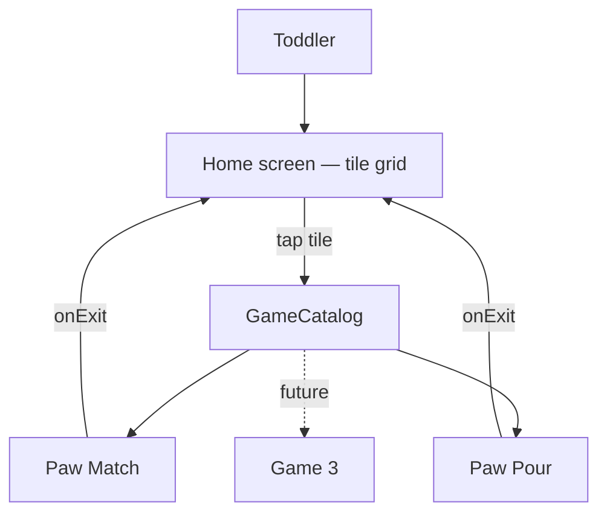

# Architecture

*Owned by the architect agent. If code and this doc disagree, fix one of them.*

## Stack
- **Language/UI**: Kotlin + Jetpack Compose (native Android). See ADR 2026-09-22 for why over Godot.
- **Local storage**: Jetpack DataStore (Preferences), added when the first game actually needs to remember something between sessions. Nothing in Milestone 1 needs persistence — every round starts fresh.
- **Third-party dependencies**: none beyond standard AndroidX/Compose libraries. No ad SDK, no analytics SDK, no billing library, no network library.

## Shape: a hub with pluggable game modules
The app is one shell (the home screen) plus a growing set of independent games. Each game is a **module that knows nothing about the others or about the shell beyond one small contract**:

```kotlin
interface MiniGame {
    val id: String              // stable, e.g. "paw-match" — never reused once shipped
    val icon: @Composable () -> Unit   // the home-screen tile's icon, no text
    val content: @Composable (onExit: () -> Unit) -> Unit  // the game itself; calls onExit() to return home
}
```

- Each game lives in its own package (`games/pawmatch/`, `games/<nextgame>/`), owns its own state, and is added to a single static list (`GameCatalog.kt`) that the home screen renders as a grid of tiles — one tile per registered game, in list order.
- **Adding a game is additive only**: a new package + one line in `GameCatalog.kt`. No existing game, and nothing in the home screen shell, should need to change to add the next one. If a change request would require touching another game to add a new one, that's an architecture problem — stop and flag it rather than special-case it.
- The home screen never shows a tile for a game that isn't actually built and registered — no "coming soon" placeholders in the shipped app (see PRD, out of scope). The grid simply has as many tiles as there are entries in the catalog.
- The home screen's tile grid and Paw Match's card grid both use a shared `AdaptiveSquareGrid` composable (`app/src/main/java/com/pawplay/app/ui/AdaptiveSquareGrid.kt`): given N same-size square things, it picks whichever column count (2-4) makes them as big as possible while still fitting on screen with no scrolling, never below a 48dp touch-target floor. Any future screen with the same "N things, must fit, no scroll" shape — including the home shelf as it grows toward its ~dozen-game target — reuses this rather than re-deriving the layout math. See `docs/DECISIONS.md`, 2026-09-23/24.
- A `MiniGame`'s `icon` composable receives the tile size it's being drawn at (not a fixed dp value), since the same tile might render at 220dp with one game on the shelf or under 100dp with a dozen. Every icon in `AnimalIcons.kt` is written as a fraction of its container size for exactly this reason — a new game's tile icon should follow the same pattern.
- Every `MiniGame.content` gets an `onExit` callback (a large, obvious "home" icon inside the game) rather than the system back button being the only way out — consistent, discoverable, works the same in every game.

## System diagram

No server, no API, no database, no network calls. Fully offline. Dotted lines are games that don't exist yet — not stubs in the code, just future catalog entries.

Paw Pour's package (`games/pawpour/`): `PawPourLogic.kt` (rules, ramp, generation, round state), `PawPourSolver.kt` (solvability search), `PawPourLayout.kt` (tube sizes/positions as plain numbers), and the Compose files `PawPourGame.kt`, `TubeView.kt`, `BandStyle.kt`. Like Paw Match, only the logic/solver/layout files are unit-tested; the Compose files just call into them.

## Data model
- **MiniGame catalog entry**: id, icon composable, content composable (see contract above). Static list, no persistence.
- **Paw Match round state** (in-memory only): list of Cards (id, matched pair id, icon reference, revealed, matched), count of matched pairs, derived "is round complete" flag.
- **Paw Pour round state** (in-memory only): a `Board` (tubes as bottom-first lists of `BandColor`, plus capacity) wrapped in a `RoundState` (round number, the board, `history` of every pour as `Step(boardBefore, move)`, and `safeDepth` = how many pours lead to the latest position known to be finishable). The ramp (`specForRound`) is a pure function of the round number, capped at round 6 (9 tubes, 7 colours). Selection, the pour animation and wobble live in the composable, not in the round state.
- (Future) **Preferences**: per-game settings worth remembering (e.g. a theme choice) — persisted via DataStore only once a specific game needs it; not a shared/global concept until two games actually want the same thing.

## Key flows
- **App open → home**: app launches straight into the home screen tile grid. No splash screen with text.
- **Tile tap → game**: tap a tile → that game's `content` composable takes over the full screen.
- **Paw Match round**: shuffle N pairs of animal icons into a grid → all cards face-down → tap flow (flip, compare after a short delay, match-and-lock or mismatch-and-flip-back) → win screen (play again / home).
- **Paw Pour round**: `generateBoard` deals a shuffled board and only keeps it if it is well mixed and the solver proves it winnable → tap a tube to lift it, tap another to pour (`Board.tap` decides: select / put down / pour / gentle wobble) → the pour animates, then `RoundState.poured` records it → `checkedFinishable()` runs the solver off the main thread → if the round can no longer be finished (no pour left, or pours that can't win), wait ~1s, then `undoLast()` step by step with a reverse animation back to `safeDepth`, and play continues → when every colour is gathered into one full tube (`Board.isSolved`; the same test as the finished-tube border and sparkle, so they always agree), win overlay (play again = next round on the ramp / home). Boards are dealt off the main thread, and "play again" keeps the win overlay up until the next board is ready. `RoundState.history` keeps at most `MAX_HISTORY` pours (never dropping any auto-undo could still need). Input is ignored while anything animates, is being checked or is being dealt; there is no sound, timer, score or counter.
- **Exit → home**: any game's exit icon calls `onExit`, returning to the tile grid. Round/game state resets; nothing carries over between plays.

## Third-party dependencies

| Library | Purpose | Network/data access |
|---|---|---|
| *(none yet)* | | |

## Release
- **Signing**: release keystore stored as a GitHub Actions secret, never in the repo. Not yet generated — run `/deploy` when ready for a signed build; a debug build is sufficient for on-device testing until then.
- **Distribution**: built and signed from `main` via `.github/workflows/deploy.yml`; sideloaded APK onto the founder's phone. No Play Store listing planned unless the founder asks for one later.
