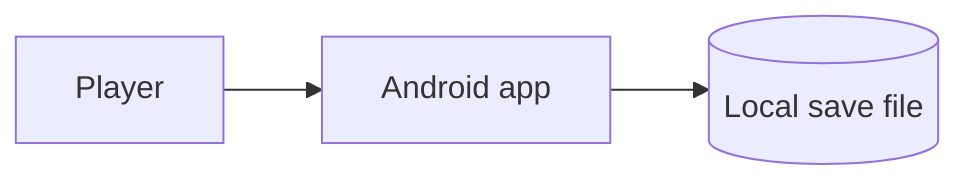

# Architecture

*Owned by the architect agent. If code and this doc disagree, fix one of them.*

## Stack
<!-- Filled during /kickoff: engine (Godot / Kotlin+Compose), local storage, any third-party libraries (should be none). -->

## System diagram

<!-- No server, no API, no database — this is a client-only, offline app. Replace only if a future feature (e.g. an opt-in leaderboard) genuinely needs one, with an ADR explaining why. -->

## Data model
<!-- Core entities in the save file: progress, unlocked levels, settings. Keep at the conceptual level. -->

## Key flows
<!-- The 1-3 flows that matter: e.g. first launch, the core game loop, resuming a saved game. Bullet steps, not prose. -->

## Third-party dependencies
<!-- Every library this project pulls in, why, and what it can access. Default is an empty table — anything added here should be justified in docs/DECISIONS.md. -->

| Library | Purpose | Network/data access |
|---|---|---|
| | | |

## Release
- **Signing**: release keystore stored as a GitHub Actions secret, never in the repo. See `docs/DECISIONS.md` for when it was set up.
- **Distribution**: built and signed from `main` via `.github/workflows/deploy.yml`; sideloaded APK and/or Google Play internal testing track.
